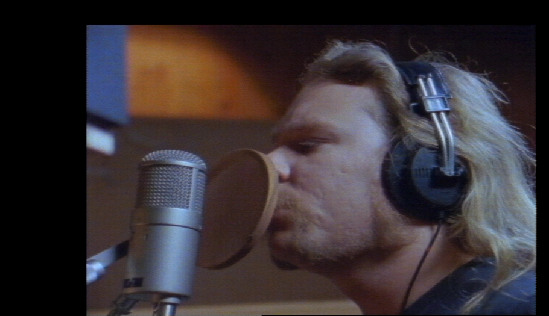

# cvbs-ai-decode

Program with a simple goal decode cvbs video using AI

this project is related to the project ld-decode and use .tbc file generated by it.
it can also be used with my project fl2K_2 for playing .tbc file after AI Y/C separation.

# Demo
3D decoding from ld-decode : 

AI Y/C separation + 2d chroma decoding : (black/white levels is a bit off)

AI Y/C separation + 3D decoding on luma + 2D chroma decoding : 

# How to use

To use the program you need to have ffmpeg instaled and in the system path.
then go to "script/windows" or "script/linux" folder depending of your OS
the folder contain 4 script :
  - ai_decode_ntsc_file
  - ai_decode_ntsc_preview
  - ai_decode_ntsc_tbc_file
  - ai_decode_ntsc_yc_file

you just need to drag and drop your .tbc file on the script you want to use
you can also open a terminal and run the script from there by putting your tbc file in parametter od the script

for using result file with ld-decode tools and fl2K_2 you can use script contained in the folder "other_script" or use your own.

# Script description

- ai_decode_ntsc_file :
  ai decoding of an NTSC .tbc to a yuv444p video file
  (using the "ntsc_decode" model)
  
- ai_decode_ntsc_preview :
  ai decoding of an NTSC .tbc to a yuv444p video and display result in ffplay
  (using the "ntsc_decode" model)

- ai_decode_ntsc_tbc_file :
  ai time base correction of an NTSC .tbc file to a new .tbc (works on cvbs and chroma)
  (using the "ntsc_yc" model)

- ai_decode_ntsc_yc_file :
  ai Y/C separation of an NTSC .tbc into 2 .tbc file containing luma and chroma
  (using the "ntsc_yc" model)
